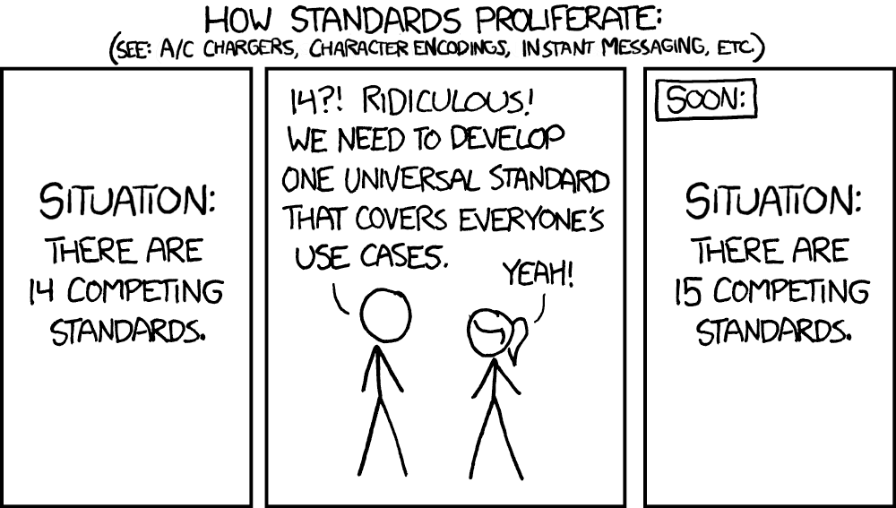

# Лабораторная работа №1

## Задание

## Введение

**Тема**: сайт с новостями и мероприятиями.

**Название**: News Hook.

**Описание**: проект является сайтом и приложением для мобильных устройст для просмотра новостей и ближайших мероприятий. Сайт/приложение приложение стремится быть универсальным решением для малого бизнеса или небольших организаций.

_xkcd_

## Предметная область

### Целевая аудитория проекта

Целевой аудиторией являются малый бизнес и небольшие организации, которым необходимо передавать информацию пользователям (клиентам) в виде новостей или будущих мероприятий, с целью их организации. Например, благотворительное мероприятие или новость о банкротстве... Это приложение позволит легко следить за всем этим. 
   
## Хранимые Сущности

Всего в базе будет несколько таблиц: _Events_, _News_, _MediaLink_, _Users_.

| Сущность         | Атрибуты                                                                  |
|------------------|---------------------------------------------------------------------------|
| События          | Название, текст в событии, дата и время события, путь к медиа             |
| Новости          | Название, текст в новости, дата и время создания новости, путь к медиа    |
| Пользователи     | Логин, пароль                                                             |
| Ссылки на медиа  | Название, ссылка, дата и время создания                                   |

## Проблема и текущее состояние

Есть несколько конкурентов, которые выполняют такие же функции.

### Raven
Сайт: https://apt.izzysoft.de/fdroid/index/apk/kshib.raven

- **Плюсы**: бесплатный, большой выбор сайтов, простой в пользовании, автоматический перевод.

- **Минусы**: нет возможности соединить со своим сайтом, не подходит под частное решение для малых организаций, ищущих свою платформу.

### Cut the noise
Сайт: https://www.cutthenoise.online/

- **Плюсы**: бесплатный, поиск новостей, с интеграцией ИИ.

- **Минусы**: нет возможности редактировать с каких сайтов искать информацию, возможно только блокировать сайты.

### P. S. Wordpress
Wordpress позволяет создавать сайты и взаимодействовать с ними через мобильные приложения. Самая главная проблема с вордпрессом - ненадежность и громоздкость, а также необходимость платить за сервис, при этом довольно большие деньги.  

### Существующие проьоемы и недостатки

Необходимо реализовать

- Сайт, на котором можно добавлять новости/мероприятия;
- Легкое, но удобное приложение;
- Вариант для действительно маленьких организаций, которые могли бы поднимать вебсайт на личных серверах или дешевых хостингах;
- Понятный интерфейс. 

## Цель и задачи проекта

Целью является проектирование и разработка сайта и приложения для ведения новостного сайта для маленьких компаний.

Основные задачи:

- Проанализировать предметную область.
- Определить требования к проекту и сформировать техническое задание.
- Спроектировать сервис.
- Разработать MVP с подключением сторонних интеграций.
- Провести ручное и автоматизированное тестирование сервиса.
- Написать пользовательскую документацию.
- Ввести сервис в эксплуатацию.

## Основные требования

### Функциональные требования

- Редактор новостей;
- Редактор мероприятий;
- Использование API для связи backend с приложением для мобильных устройств;
- Удобное приложение.

### Нефункциональные требования

- Удобный дизайн;
- Документация сервиса;
- Тесты.

### Оценка ресурсов на разработку

### Временные затраты на разработку MVP

- Блок 1. Планирование и анализ требований - 1 апреля – 14 апреля
- Блок 2. Определение требований - 14 апреля – 21 апреля
- Блок 3. Проектирование - 21 апреля – 13 мая
- Блок 4. Разработка -  30 апреля – 13 мая
- Блок 5. Тестирование - 10 мая – 22 мая
- Блок 6. Развертывание - 22 мая – 25 мая 

### Финансовые затраты на разработку MVP

- Ставка студента: 0 рублей/час, занятость - 10 часов в неделю.
- Сайт приложения: бесплатно (пост на гитхаб).
- ПО для проектирования и разработки: бесплатно.

| Наименование           | Сумма          |
|------------------------|----------------|
| студент                | 0 рублей       |
| сайт                   | 0 рублей       |

Итого: 0 рублей.
